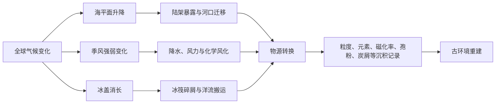

# 课程名称《第四纪地质学》

# 文献阅读报告

## 题目

末次冰期以来沉积记录揭示的古环境演变及其驱动机制

作者：________

专业：________

学号：________

## 摘要

末次冰期以来的气候波动、海平面升降、季风强弱变化和冰盖消长，是第四纪地质与环境研究中的核心问题。本文以 1-10.md 所列 10 篇文献为阅读对象，围绕滨海潮坪、边缘海、深海峡谷、湖相-风沙沉积、黄土、陆坡沉积和内陆盆地沉积记录，梳理不同沉积体系对古环境变化的响应方式。文献表明，可靠年代框架是沉积记录解释的基础，OSL、AMS14C 等测年方法与粒度、磁化率、主量元素、XRF 岩芯扫描、碎屑锆石 U-Pb 年龄、孢粉和炭屑等指标结合，能够较好地区分沉积相、物源变化、风化强度和生态环境响应。综合来看，海平面变化主要通过改变河流入海位置、陆架暴露范围、搬运距离和洋流格局来控制滨海及边缘海物源转换；东亚季风、印度季风及冬季风变化则影响陆源碎屑输入、化学风化强度、粉尘活动和湖泊水位；北大西洋冰盖及高纬气候事件可通过千年尺度气候突变影响东亚和青藏高原环境。个人认为，未来研究应加强多指标定量化、区域对比和过程机制约束，避免仅凭单一指标直接推断气候变化。

关键词：第四纪地质；末次冰期；沉积记录；海平面变化；古环境演变

## 1. 研究背景

第四纪是距离现代人类社会最近的地质时期，冰期-间冰期旋回、快速气候事件、海平面升降和生态环境变化均在这一时期表现突出。末次冰期以来的沉积记录保存较好，年代相对容易约束，因此成为认识过去环境变化、理解现代环境问题和预测未来变化的重要窗口。

所读文献的研究区包括韩国西南海岸潮坪、冲绳海槽、澎湖峡谷、冰岛南部陆坡、鄱阳湖及九江地区、山东半岛、川西高原阿坝盆地、渭河盆地和河套盆地。这些区域沉积环境差异很大，但研究问题具有一致性：沉积物的粒度、成分、结构、物源和生物生态指标如何记录末次冰期以来的气候与环境演变。

从阅读目的看，这 10 篇文献并不是孤立讨论某一个剖面或某一种指标，而是共同指向第四纪环境研究中的一个核心问题：地球表层系统如何把外部气候驱动转化为可保存的沉积信号。海平面变化、季风强弱、冰盖消长和流域风化剥蚀都不会直接以“文字”的形式保存在地层中，而是通过沉积相转换、物源改变、颗粒组成变化、元素比值波动、生物组合变化等方式间接留下痕迹。因此，阅读这些文献时不能只记住每篇文章的结论，更重要的是理解作者怎样从沉积物出发，逐步推断古环境过程。

从海陆联系角度看，边缘海和海岸带沉积最能反映海平面变化。韩国 Baeksu 潮坪研究显示，潮控河口充填中保存了多级次海侵沉积旋回，MIS5e、MIS5a/b、MIS3 和全新世海侵过程在钻孔沉积相中均有体现[1]。冲绳海槽研究则表明，末次盛冰期以来海平面变化通过控制长江古河系、台湾物源和现代环流格局，主导陆源碎屑输入与物源转换[2]。澎湖峡谷的高分辨率 XRF 记录进一步说明，海平面低stand阶段搬运距离缩短、粗粒陆源碎屑输入增强，而季风降雨变化控制化学风化强度[6]。

从陆地环境角度看，风沙、黄土、湖相和盆地沉积记录能够反映季风、干湿变化和生态响应。九江蓼花剖面湖相-古土壤-沙丘砂序列记录了 48.8-14.5 ka 期间寒冷干燥、温暖湿润、再转寒冷干燥的阶段性变化[3]；山东半岛东山剖面通过主量元素和 CIA 指数指出，末次冰期风沙沉积受东亚季风、气温和海平面共同影响[4]；阿坝盆地黄土记录说明末次冰期粉尘活动在末次盛冰期最强，MIS3 中晚期印度季风增强、环境相对湿润[5]。河套盆地研究则把湖泊水位、植被和火历史联系起来，识别出 Heinrich 事件和 D/O 旋回等千年尺度气候波动[10]。

因此，本文将阅读专题概括为“末次冰期以来沉积记录揭示的古环境演变及其驱动机制”。这一专题符合第四纪地质学课程要求：一方面，它涉及晚更新世以来的典型第四纪沉积体系；另一方面，它又与当前全球变化研究、海岸带演变、干旱区生态环境和区域灾害治理等现实问题有关。尤其是在我国，鄱阳湖沙山、山东半岛风沙沉积、青藏高原黄土和河套盆地古湖泊等研究，都能为区域生态修复和环境敏感性评价提供地质历史背景。

## 2. 研究方法

这些文献共同体现了第四纪古环境研究的基本技术路线：首先建立年代框架，其次识别沉积相与沉积环境，再通过多指标综合解释气候、海平面、物源和生态过程。

表 1 为本文根据 10 篇文献整理的主要研究对象与方法。

| 文献 | 研究对象 | 关键方法 | 主要环境信息 |
|---|---|---|---|
| [1] | 韩国 Baeksu 潮坪钻孔 | 岩相分析、OSL 测年、层序地层 | 海侵旋回、潮控河口充填 |
| [2] | 冲绳海槽 C1624 岩芯 | AMS14C、主量元素、粒度、PCA | 海平面控制物源转换 |
| [3] | 九江蓼花湖相-风沙剖面 | OSL、14C、粒度、磁化率、重矿物 | 末次冰期干湿阶段变化 |
| [4] | 山东半岛东山风沙沉积 | OSL、粒度、主量元素、CIA | 风化强度、季风与海平面影响 |
| [5] | 川西阿坝盆地黄土 | 石英 OSL、粒度、磁化率、色度、粉尘通量 | 高原粉尘活动与季风变化 |
| [6] | 澎湖峡谷 MD18-3570 岩芯 | AMS14C、1 cm 分辨率 XRF 扫描 | 季风降雨、海平面与陆源输入 |
| [7] | 鄱阳湖南部厚田沙山 | 粒度、碎屑锆石 U-Pb、MDS 分析 | 沙山物源与短距离搬运 |
| [8] | 冰岛南部陆坡 IS-2A 岩芯 | AMS14C、粒度、颜色反射率、XRF、因子分析 | 冰盖消长与洋流搬运 |
| [9] | 渭河盆地钻孔沉积 | 粒度、磁化率、Weibull 拟合、区域对比 | 沉积相转换与古环境演变 |
| [10] | 河套盆地 HJ01 钻孔 | AMS14C、OSL、粒度端元、磁化率、孢粉、炭屑 | 湖泊水位、植被与火历史 |

年代学方面，OSL 适用于风沙、黄土、潮坪等碎屑沉积物的沉积年龄约束，AMS14C 多用于有机质、贝壳或有孔虫等含碳材料。文献[1]、[3]、[4]、[5]、[10]都强调年代框架的重要性，因为没有可靠年龄控制，沉积相边界、环境事件和全球气候记录之间很难进行准确对比。

沉积学方面，粒度是最常用的指标之一。粗粒组分常反映较强水动力、风力或近源输入，细粒组分则多与低能湖泊沉积、远距离粉尘搬运或稳定沉积环境有关。文献[9]用 Weibull 分布拟合提取粒度组分，文献[10]用端元分析区分深湖沉积、粉尘、沙漠砂和河流组分，说明粒度数据已经从简单均值描述走向过程分解。

地球化学方面，主量元素、元素比值和 XRF 岩芯扫描能够反映物源、风化强度和粒度变化。文献[6]以 K/Al 指示陆源碎屑化学风化状态，以 Si/Al 和 Zr/Al 指示粒度变化；文献[4]用 CIA 指数讨论山东半岛风沙沉积的风化强度；文献[2]则用 TFe2O3/Al2O3 和 CaO/Al2O3 区分陆源输入和生物碳酸盐贡献。

物源示踪方面，文献[7]通过碎屑锆石 U-Pb 年龄识别鄱阳湖南部厚田沙山主要来自近源九岭山与赣江沉积物的混合，说明沙山并非简单远源搬运产物。文献[8]利用 XRF 与因子分析识别冰岛南部陆坡沉积物来源，揭示末次盛冰期以来冰岛冰盖、不列颠-爱尔兰冰盖、斯堪的纳维亚冰盖和劳伦德冰盖输入的阶段变化。

生物与生态指标方面，文献[10]使用孢粉和炭屑重建植被与火历史，表明在温暖湿润阶段生物量较高，可为火活动提供燃料。这类指标使沉积记录不仅能描述物理沉积过程，也能反映生态系统响应。

## 3. 结果与讨论

### 3.1 海平面变化重塑海岸带与边缘海沉积格局

多篇文献共同表明，海平面变化是控制海岸带和边缘海沉积体系的一级因素。韩国 Baeksu 潮坪保存了两个约 100 ka 尺度的四级层序，以及嵌套其中的约 40 ka 尺度五级海侵亚层序[1]。这说明沉积记录并非只响应完整冰期-间冰期旋回，也会记录较短时间尺度的间冰阶海平面波动。

冲绳海槽研究将末次盛冰期以来陆源输入划分为三个阶段：25.4-11.6 ka BP 低海平面时期，长江古河系向外陆架延伸并成为主要物源；11.6-8.7 ka BP 快速海侵时期，物源由长江向台湾物质转变且陆源输入下降；8.7 ka BP 以来现代环流格局建立，台湾来源物质占优[2]。这一模式说明海平面不仅改变陆架暴露范围，也改变河流入海口位置、沉积搬运路径和洋流输送条件。

澎湖峡谷记录也支持这一认识。低海平面时期，陆源碎屑搬运距离缩短，Zr/Al 等粗粒指标升高；而季风降雨增强时，流域化学风化增强，K/Al 发生相应变化[6]。因此，海平面与季风并不是彼此孤立的控制因素，而是分别通过地形通道、搬运距离、水文过程和风化强度共同作用于沉积记录。

### 3.2 季风变化控制陆地干湿格局与粉尘活动

陆地剖面和盆地沉积显示，末次冰期内部并非持续寒冷干燥，而是存在显著阶段性波动。九江蓼花剖面显示，48.8-39.5 ka 为寒冷干燥期，冬季风强；39.5-28.1 ka 转为温暖湿润期，夏季风增强；28.1-14.5 ka 再次进入寒冷干燥期，但存在短暂暖湿波动[3]。山东半岛东山剖面也记录了干冷-湿润-干冷的旋回，说明末次冰期风沙沉积不仅反映冬季风强度，也受海平面变化和物源改变影响[4]。

阿坝盆地黄土研究显示，末次冰期粉尘活动存在明显波动，末次盛冰期最强；MIS3 中晚期印度季风增强，高原环境相对湿润[5]。这一结果提示，青藏高原东部环境变化不仅受东亚季风影响，也与印度季风和北半球高纬气候系统联系密切。河套盆地 HJ01 钻孔则重建了 MIS4-MIS2 阶段完整湖泊与气候演化：MIS4 和 MIS2 整体偏冷干，MIS3 相对温暖湿润，湖泊水位较高[10]。

### 3.3 物源变化是连接环境变化与沉积响应的关键环节

物源研究能够解释沉积物“从哪里来”，是理解沉积记录环境意义的重要环节。鄱阳湖南部厚田沙山研究显示，沙山样品碎屑锆石 U-Pb 年龄主要峰约为 830 Ma，次峰约为 430 Ma，与江南造山带东段九岭地区及赣江沉积物关系密切，表明其主要为近源物质短距离搬运堆积[7]。这一结论对区域风沙治理也有现实意义：如果沙源主要来自近源裸露河漫滩和河岸地表，治理重点就应放在局地沙源固定与枯水期地表保护。

冰岛南部陆坡研究则展示了冰盖活动对海洋沉积物来源的影响。末次盛冰期沉积物主要来自冰岛冰盖、不列颠-爱尔兰冰盖和斯堪的纳维亚冰盖；冰消期早期陆源碎屑整体增加，并出现远端劳伦德冰盖物质输入；全新世现代洋流体系形成后，沉积物主要来自冰岛和欧洲西部[8]。这说明冰盖消长、洋流强弱和海洋搬运过程共同决定陆坡沉积物的来源组合。

### 3.4 单一指标解释存在局限，多指标综合是发展方向

这些文献也提醒我们，古环境指标往往具有多解性。例如 CIA 常被用于指示化学风化强度和湿润程度，但山东半岛东山剖面研究指出，低海平面时期物源改变和继承性风化也可能导致较高 CIA 值，因此不能简单把 CIA 高值等同于夏季风增强[4]。同样，磁化率在黄土、湖泊和河流沉积中的意义并不完全相同，必须结合沉积相和物源背景解释。

因此，较可靠的研究思路应是“年代框架 + 沉积相 + 多指标 + 区域对比”。文献[1]强调如果缺少密集年龄数据，潮坪沉积中的层序界面可能难以识别；文献[2]提出未来需要结合 Sr-Nd-Pb 同位素和矿物组合，定量分解长江、黄河和台湾等端元贡献；文献[10]也指出可提高孢粉样品分辨率，进一步刻画植被对千年尺度气候突变的响应。这些都说明第四纪环境研究正在从定性描述走向高分辨率、定量化和机制化。

图 1 为根据文献归纳的末次冰期以来沉积记录环境解释框架。

### 3.5 逐篇文献阅读与综合评述

为了使阅读报告不仅停留在总体概括层面，下面对 10 篇文献逐篇进行梳理，并在每篇之后结合本专题作简要评述。这样处理的目的，是把“文献讲了什么”“用了什么证据”“对第四纪环境研究有什么启发”三个层次分开说明。

#### 3.5.1 韩国 Baeksu 潮坪多级次海侵旋回研究

文献[1]研究韩国西南海岸 Baeksu 潮坪晚第四纪沉积序列，是一篇以潮控河口沉积和层序地层为核心的英文文献。该研究利用三个深钻孔资料，在较可靠的 OSL 年代控制基础上，进行岩相分析、沉积相组合划分和层序地层解释。文章的重要结论是：Baeksu 潮坪自 MIS6 以来主要受多频率海平面变化控制，沉积序列中不仅保存了与冰期-间冰期旋回相关的约 100 ka 尺度四级层序，还保存了 MIS5a/b 和 MIS3 间冰阶短期海平面上升形成的约 40 ka 尺度五级亚层序。

这篇文献给我的第一点启发是，潮坪和河口沉积体系对海平面变化非常敏感，但保存下来的记录并不是简单、完整、对称的海侵-海退序列。作者指出，在该潮控近岸环境中，海侵沉积保存潜力明显高于强迫海退或静止阶段沉积。这是因为研究区缺少大型河流持续提供大量沉积物，海退阶段容易发生暴露、侵蚀或沉积间断，而海侵阶段形成的潮坪泥、潮道沉积、砂坝和海滩沉积更容易在后期被保存下来。由此可见，地层记录具有选择性，并非所有环境事件都会等比例地保存在沉积物中。

第二点启发是，岩性边界不一定等于层序边界。文献[1]强调，如果缺少密集可靠的年龄数据，一些层序界面在岩性上并不明显，尤其在靠海一侧可能因波浪侵蚀或后期改造而难以识别。这对第四纪研究很重要，因为我们在野外或钻孔中看到的沉积界面，往往只是沉积过程的结果之一，真正的时间界面可能被掩盖、迁移或侵蚀。该文提醒我们，层序地层解释不能只依赖岩性突变，还要结合年代学、沉积相演替和区域海平面背景。

从本报告主题看，文献[1]主要展示了海平面变化如何通过控制容纳空间、岸线迁移和沉积相带移动影响沉积记录。它与冲绳海槽、澎湖峡谷文献形成呼应：前者关注潮坪内部的相带与层序，后两者关注边缘海和深海峡谷中的物源与粒度响应。三者共同说明，海平面是晚第四纪海陆过渡带沉积演化的关键驱动。

#### 3.5.2 冲绳海槽陆源沉积物来源演变研究

文献[2]研究末次盛冰期以来冲绳海槽中部 C1624 岩芯陆源沉积物来源演变，是一篇围绕边缘海源-汇过程和海平面控制作用展开的英文文献。研究区位于东海陆架外缘与琉球岛弧之间，既受长江、黄河、台湾造山带等陆源物质影响，也受黑潮及东亚季风调控。因此，冲绳海槽沉积物记录具有复杂性：沉积物中既有陆源碎屑，也有海洋生物碳酸盐，还可能受到火山和热液物质影响。

该文通过主量元素地球化学、AMS14C 年代、粒度和矿物学资料综合分析，利用 PCA 判断沉积物主要由陆源碎屑和海洋生物碳酸盐两个端元组成，并选择 TFe2O3/Al2O3 作为陆源输入指标、CaO/Al2O3 作为生物碳酸盐贡献指标。研究将末次盛冰期以来陆源输入划分为三个阶段：25.4-11.6 ka BP 低海平面阶段，古长江河系向外陆架延伸，长江物质成为主要来源；11.6-8.7 ka BP 快速海平面上升阶段，物源由长江向台湾物质过渡，陆源输入量下降；8.7 ka BP 以来现代环流格局建立，台湾来源物质占优。

这篇文章的核心贡献在于把海平面变化与物源转换联系起来。海平面下降时，东海陆架大面积暴露，河流入海口向外迁移，长江物质更容易输送到海槽；海平面上升后，陆架被淹没，长江物质被更多截留在内陆架和河口三角洲区域，而台湾来源物质则可借助黑潮及相关环流向海槽输送。也就是说，沉积物物源变化不是单纯由河流供给量决定，而是由海平面、陆架地形、环流屏障和搬运路径共同控制。

我认为该文对理解“源-汇系统”很有帮助。传统上我们可能会把物源分析理解为寻找沉积物来自哪条河、哪片山地，但文献[2]表明，物源还具有明显的时间性。同一地点在不同时期接收的物质来源可以完全不同，而这种差异往往与海平面和环流格局变化有关。对第四纪环境研究而言，这意味着在解释元素或矿物变化时，不能默认物源长期稳定；如果物源发生改变，许多气候代用指标的意义也会随之改变。

#### 3.5.3 九江蓼花剖面湖相-风沙沉积气候记录

文献[3]以江西九江蓼花剖面“湖相-古土壤-沙丘砂”沉积序列为研究对象，利用 OSL 和 14C 测年建立 48.8-14.5 ka 的年代框架，并通过粒度、磁化率和重矿物指标重建末次冰期中晚期气候变化。研究区位于鄱阳湖西侧，受东亚季风影响明显，同时存在湖泊、水系和风沙活动交互作用，因此是研究湿润季风区风沙沉积与湖相沉积关系的典型区域。

该文把剖面沉积相与古气候阶段联系起来。沙丘砂层磁化率较低、平均粒径较粗、成熟度指数较低，指示风化程度较弱，形成于寒冷干燥且冬季风强盛的环境；古土壤层磁化率较高、粒度较细、风化程度较高，代表温暖湿润、夏季风较强的环境；湖相层则形成于暖期还原环境，反映湖泊水体存在和较强风化作用。根据这些指标，作者将研究区末次冰期中晚期划分为三个阶段：48.8-39.5 ka 为寒冷干燥期，39.5-28.1 ka 为温暖湿润期，28.1-14.5 ka 再次进入寒冷干燥期，但存在短暂暖湿波动。

这篇文献的特点是将沉积相识别与环境指标结合得比较紧密。湖相、古土壤和沙丘砂本身就代表不同沉积环境，在此基础上再分析粒度、磁化率和重矿物，解释更具有约束性。相比单纯依赖粒度曲线判断气候，沉积相组合能够提供更直接的环境背景。例如，沙丘砂不只是“粗粒沉积”，还代表风力搬运和地表干燥条件；古土壤不只是“细粒或高磁化率”，还反映成壤作用和植被覆盖改善。

从区域意义看，该文说明湿润季风区也会在末次冰期出现强烈风沙活动。鄱阳湖地区今天并不是典型沙漠区，但晚更新世气候波动、水位下降和冬季风增强可以使河漫滩、湖滨和裸露地表成为沙源。这对理解现代鄱阳湖周边沙化问题也有启发：沙化并不一定只发生在干旱区，在季风区湖泊水位波动、河岸裸露和强风共同作用下，也可能形成显著风沙沉积。

#### 3.5.4 山东半岛东山剖面主量元素与风化指标研究

文献[4]研究山东半岛北部东山剖面末次冰期风沙沉积，基于 OSL 年代框架，开展粒度和主量元素地球化学分析。研究结果表明，该剖面堆积年代为 49.1-14.7 ka，可划分为干冷-湿润-干冷三个阶段。主量元素以 SiO2、Al2O3 和 Fe2O3 为主，CIA 指数用于讨论化学风化强度和古环境意义。

这篇文章值得注意的地方，是它没有简单地把 CIA 高值解释为夏季风增强或气候湿润，而是指出山东半岛末次冰期风沙沉积受东亚季风、气候温度和海平面变化共同控制。低海平面时期，黄海陆架暴露，物源区范围和沉积物搬运路径可能发生变化；同时，沉积物可能携带源区继承性风化信号。因此，CIA 值并不完全由沉积时当地夏季风强弱控制，也可能受到物源改变和前期风化程度影响。

这一认识对阅读古环境文献非常重要。许多代用指标看起来有明确含义，例如高 CIA 常被解释为强化学风化、高磁化率常被解释为强成壤或暖湿气候、粗粒常被解释为风力增强。但实际沉积系统中，一个指标往往受到多个因素共同影响。文献[4]提醒我们，在解释地球化学指标时必须考虑物源、搬运、沉积后改造和区域地貌背景。

此外，文献[4]认为 CIA 变化可能记录了多次 Heinrich 事件，这说明山东半岛风沙沉积不仅响应区域季风变化，也可能与北半球高纬气候突变存在联系。末次冰期气候系统具有明显的遥相关特征，高纬冰盖和北大西洋环流变化可以通过大气环流影响东亚冬季风和粉尘活动。因此，该文不仅是一个区域剖面研究，也体现了区域沉积记录与全球气候事件之间的联系。

#### 3.5.5 川西高原阿坝盆地黄土与环境变化研究

文献[5]为硕士学位论文，研究川西高原阿坝盆地末次冰期黄土沉积过程与环境变化。该文以两个典型黄土剖面为对象，利用石英 OSL 测年建立年代框架，并结合粒度、磁化率、色度、碳酸盐和粉尘通量等指标，讨论青藏高原东部末次冰期以来粉尘活动与古环境演化。

论文首先验证了阿坝盆地黄土-古土壤序列的石英 OSL 适用性。预热坪和剂量恢复实验显示石英信号较可靠，说明 SAR 法可为该地区末次冰期黄土沉积提供年代约束。随后，作者指出各莫和正达剖面底部年代约为 44 ka 和 47 ka，表明阿坝盆地黄土主要开始堆积于末次冰期以来。粉尘活动在末次盛冰期最强，MIS3 中晚期印度季风增强，高原环境相对湿润；粒度记录还反映了新仙女木事件和多次 Heinrich 事件。

这篇文献把青藏高原东部纳入末次冰期粉尘和季风变化讨论中。与黄土高原经典黄土剖面相比，阿坝盆地位于高原东缘，既受高原地形影响，也受东亚季风和印度季风共同作用。其黄土记录说明，高原地区并非只是被动接受外部粉尘输入，而是对季风、水热条件和高纬气候波动都有敏感响应。

我认为该文的一个重要价值，是强调可靠年代控制对高原黄土研究的基础意义。高原地区地形复杂，沉积速率和局地再搬运可能较强，如果缺少 OSL 年代约束，仅凭岩性或指标曲线很难判断沉积序列是否连续、是否存在间断、是否能与区域气候事件对应。该文通过测年和多指标结合，为青藏高原东部晚第四纪环境变化提供了较清晰的框架。

#### 3.5.6 澎湖峡谷高分辨率 XRF 沉积记录研究

文献[6]研究南海东北部澎湖峡谷 MD18-3570 岩芯，利用 1 cm 分辨率 XRF 岩芯元素扫描并结合 14C 测年，重建过去 54 ka 以来深海峡谷沉积记录及其控制机制。澎湖峡谷位于台湾附近，受台湾造山带快速剥蚀、东亚季风降雨、海平面变化和深海峡谷输送过程共同影响，是研究陆源物质从山地到深海快速输送的理想区域。

该文选择 K/Al 比值反映陆源碎屑化学风化状态，Si/Al 和 Zr/Al 反映陆源碎屑粒度变化。研究发现，K/Al 变化与董哥洞-葫芦洞石笋氧同位素记录相似，并在新仙女木和 Heinrich 事件期间呈现异常高值，表明东亚季风降雨减弱时，台湾流域化学风化减弱、物理剥蚀增强，深海沉积记录表现为 K/Al 升高。Zr/Al 在 12-30 cal.kaBP 低海平面时期升高，说明陆源碎屑搬运距离缩短、粗粒输入增强。

文献[6]的逻辑非常清楚：季风主要控制流域风化状态，海平面主要控制粗粒陆源碎屑输入。两种驱动分别作用于不同沉积信号，但又共同影响同一根岩芯记录。这一点对理解复杂沉积系统很有帮助。很多时候，我们希望用一个指标解释全部环境变化，但该文显示，不同指标可能对应不同过程，必须把它们分别拆解后再综合。

该文还体现了高分辨率记录的优势。1 cm 分辨率 XRF 扫描能够识别百年-千年尺度波动，使澎湖峡谷沉积记录可以与石笋、冰芯和全球冷事件进行对比。对第四纪环境研究而言，高分辨率不仅意味着数据点更多，也意味着可以讨论快速气候事件、突变响应和过程滞后，而不仅仅是冰期-间冰期的大尺度变化。

#### 3.5.7 鄱阳湖南部厚田沙山物源研究

文献[7]关注鄱阳湖南部厚田沙山末次冰期以来的物质来源。研究通过 6 件碎屑锆石样品 U-Pb 年龄分析，获得 512 个有效年龄数据，并结合粒度与 MDS 分析，探讨沙山是远源搬运还是近源堆积。结果显示，沙山样品碎屑锆石 U-Pb 年龄主要峰约为 830 Ma，次峰约为 430 Ma，与江南造山带东段九岭地区岩浆岩和赣江沉积物具有良好对应关系。因此，研究区沙山主要来自近源九岭山与赣江沉积物混合物。

该文的形成机制解释也较清楚：末次冰期枯水期水位下降，赣江支流和干流河漫滩、河岸裸露，地表沙物质在强劲冬季风作用下短距离搬运至河流阶地堆积。也就是说，厚田沙山形成不是简单的远源沙尘沉降，而是水位下降、近源物质暴露和冬季风搬运共同作用的结果。

这篇文献对本专题的意义在于，它把物源示踪与环境过程联系起来。碎屑锆石 U-Pb 年龄本身是物源判别工具，但其环境意义在于帮助我们判断风沙沉积系统的物质基础。如果沙源来自远源，则需要强调区域大气环流和长距离输送；如果沙源来自近源，则应关注局地河湖水位、裸露地表和短距离风力搬运。文献[7]支持后者，因此对鄱阳湖地区土地沙化治理具有现实参考价值。

我个人觉得，这类研究也说明第四纪地质学与现实环境治理之间并不遥远。现代沙化治理往往需要知道沙源在哪里、搬运路径如何、什么季节最容易起沙，而晚第四纪沙山物源研究恰好提供了长期尺度的证据。过去的形成机制虽然不能完全等同于现代过程，但能帮助我们理解区域景观对气候和水位变化的敏感性。

#### 3.5.8 冰岛南部陆坡沉积物来源与冰盖响应研究

文献[8]研究冰岛南部陆坡 ARC05/IS-2A 岩芯末次盛冰期以来沉积物来源变化及其对周边冰盖消长的响应。该研究利用浮游有孔虫 AMS14C 测年建立年代框架，并开展粒度、颜色反射率和高分辨率 XRF 元素地球化学测试，通过因子分析确定主要物质来源。

研究表明，末次盛冰期以来 IS-2A 岩芯沉积物以陆源输入为主。末次盛冰期，碎屑物质主要来自冰岛冰盖、不列颠-爱尔兰冰盖和斯堪的纳维亚冰盖；末次冰消期初期，陆源碎屑整体增加，来源包括近源冰岛冰盖、斯堪的纳维亚冰盖、不列颠-爱尔兰冰盖以及远端劳伦德冰盖；冰消期中后期，由于搬运条件减弱，劳伦德冰盖输入减少；进入全新世后，现代洋流体系形成，沉积物主要来自冰岛和欧洲西部，也有部分来自拉布拉多半岛。

与东亚季风区文献相比，这篇文章的主控因素更强调冰盖活动和洋流搬运。冰盖扩张和崩解会改变冰筏碎屑输入，洋流体系则决定不同源区物质能否到达研究区。由此可见，不同地区的第四纪沉积记录虽然都受全球气候变化影响，但具体驱动机制具有区域差异。东亚边缘海强调海平面、季风和河流输入，北大西洋高纬区则更强调冰盖、冰筏碎屑和深水环流。

文献[8]的另一个启发是，物源变化可以反映冰盖活动阶段。冰盖消退并不只是陆地冰量减少，也会通过碎屑释放、漂冰输送和洋流重组改变海洋沉积物来源。沉积物来源变化因此成为重建冰盖消长的重要证据。这使我认识到，第四纪沉积记录不仅可以反映气温和降水，也可以记录冰冻圈变化。

#### 3.5.9 渭河盆地沉积相变化与古环境意义研究

文献[9]研究渭河盆地西安凹陷 ZZC 钻孔末次间冰期以来沉积相变化及其影响。该文通过与邻近渭南黄土剖面粒度曲线和全球 LR04 深海氧同位素曲线对比建立年代标尺，并利用粒度、磁化率和 Weibull 分布拟合方法，提取不同粒度组分，讨论风尘-湖相沉积对风力和水动力的不同响应。

研究认为，ZZC 钻孔在约 80 ka 左右发生沉积相转变，由湖泊沉积转向风成沉积。尽管沉积相发生变化，粒度指标仍然对沉积环境变化敏感，并可与黄土和石笋记录对比。但磁化率与粒度之间的关系受到沉积相变化影响，在水成环境和风成环境中并不完全一致。

这篇文献对于指标解释具有很强警示意义。沉积相变化会改变代用指标的气候意义。例如，在风成沉积中，粒度变粗通常代表冬季风增强、气候偏干冷；在湖泊沉积中，粒度变粗可能代表水动力增强、湖面下降或洪水输入。磁化率在黄土中常与成壤作用和夏季风有关，但在湖相沉积中可能受还原溶解、水动力分选和陆源输入控制。因此，如果忽略沉积相背景，就可能把同一指标在不同时段的意义混为一谈。

我认为文献[9]在阅读方法上也有启发。它不是只给出一个结论，而是反复讨论“指标为什么在这里可以解释，在哪里需要谨慎解释”。这种写法体现了科学研究中的不确定性意识。对于文献阅读报告来说，也不应只总结作者结论，还应注意作者如何处理指标局限和解释边界。

#### 3.5.10 河套盆地环境演变与火历史研究

文献[10]为硕士学位论文，研究河套盆地 HJ01 钻孔记录的末次冰期环境演变及火历史。该研究选取 HJ01 钻孔上部 23.68 m 岩芯，通过 AMS14C、OSL、粒度、磁化率、孢粉和炭屑指标，重建末次冰期湖泊、气候、植被和火活动历史。研究区位于东亚季风边缘和干旱-半干旱过渡区，对气候变化敏感。

研究结论显示，河套盆地末次冰期 MIS4-MIS2 阶段湖泊和气候演化较完整：MIS4 阶段湖泊水位较低，气候寒冷干燥；MIS3 阶段湖泊水位较高，气候相对温暖湿润；MIS2 阶段湖泊收缩甚至干涸，气候寒冷干燥。通过与全球气候记录对比，作者识别出 5 次 Heinrich 事件和 19 次 D/O 旋回，说明河套盆地环境对千年尺度气候波动也有响应。

该文的特色在于把火历史纳入古环境演化研究。孢粉结果显示，末次冰期河套盆地周边山地存在云杉、松等针叶林，盆地内以藜亚科、蒿属等荒漠草原植被为主。炭屑记录表明，MIS3 相对温暖湿润阶段火活动较多，而 MIS4 和 MIS2 冷干阶段火活动较少。作者认为，区域火活动受生物量影响明显，暖湿条件促进植被生长，提供更多燃料，从而有利于火活动发生。

这一结论很有意思，因为它并不简单认为干旱一定导致火活动增强。火的发生需要气候、燃料和点火条件共同作用。在极端冷干阶段，虽然环境干燥，但生物量不足，燃料有限，火活动反而可能减少；在相对暖湿阶段，植被生长旺盛，燃料积累增加，火活动更容易发生。这说明生态系统响应具有复杂性，也提醒我们解释炭屑记录时不能只看干湿条件。

### 3.6 综合讨论：十篇文献之间的共同问题

综合 10 篇文献可以看出，末次冰期以来沉积记录研究主要围绕四个共同问题展开。第一是时间问题，即沉积物形成于什么时候，能否与 MIS 阶段、末次盛冰期、冰消期、全新世或 Heinrich 事件对应。第二是沉积环境问题，即沉积物是在潮坪、陆坡、湖泊、风沙、黄土还是河湖过渡环境中形成。第三是物质来源问题，即沉积物来自近源山地、河流、陆架、冰盖还是远距离粉尘。第四是环境解释问题，即这些沉积变化究竟反映海平面、季风、冰盖、洋流还是生态过程。

这些问题之间不是并列孤立的，而是层层递进。没有年代框架，就无法讨论环境演变阶段；没有沉积相识别，就无法判断指标含义；没有物源约束，就难以区分气候信号和来源变化；没有区域对比，就难以判断某一变化是局地事件还是区域或全球事件。一个较完整的第四纪环境研究，往往需要把这四层证据都尽量补齐。

从驱动机制看，海平面变化在海岸带、边缘海和深海峡谷记录中最突出。文献[1]、[2]和[6]分别从潮坪层序、冲绳海槽物源转换和澎湖峡谷粗粒输入三个角度说明，海平面变化会改变容纳空间、陆架暴露范围、河口位置、搬运距离和洋流通道。它不是单一因素，而是通过重塑地貌边界和沉积路径影响沉积记录。

季风变化在陆地和近海记录中都很重要。文献[3]、[4]、[5]、[6]和[10]均涉及东亚季风、印度季风或冬季风变化。季风可以通过降水影响湖泊水位、植被、化学风化和河流搬运，也可以通过风力影响粉尘释放、风沙沉积和粒度组成。季风强弱变化往往与冰期内部冷暖波动有关，尤其在 Heinrich 事件和 D/O 旋回期间表现明显。

物源变化则是连接驱动机制与沉积响应的中间环节。文献[2]中的长江-台湾物源转换、文献[7]中的近源九岭山和赣江物质、文献[8]中的多冰盖来源、文献[6]中的台湾流域输入，都说明沉积物来源本身会随环境变化而变化。如果不进行物源识别，可能把来源变化误判为气候变化。例如元素比值变化可能不是风化强度改变，而是源区岩性或搬运路径改变；粒度变化也可能不是风力变化，而是沉积点与源区距离改变。

生态响应是这些文献中相对延伸但很有意义的部分。文献[10]利用孢粉和炭屑说明气候变化会影响植被和火活动，进而影响陆地生态系统结构。相比粒度和元素指标，孢粉、炭屑等生物生态指标更接近地表生态过程，也更能与现代环境问题联系起来。未来如果能把沉积学、地球化学和生态指标结合得更紧密，第四纪研究对现代生态治理的参考价值会更强。

从研究不足看，十篇文献虽然都使用了多指标方法，但仍存在一些共同限制。首先，许多结论依赖单个剖面或单根岩芯，空间代表性需要更多样点验证。其次，部分指标具有多解性，需要更强的现代过程研究来校准。例如现代河流、湖泊、潮坪和风沙环境中的粒度-动力关系，可以为古记录解释提供基础。再次，源-汇过程仍需定量化，未来应更多使用同位素、矿物组合、端元模型和数值模拟，建立更可检验的物质输送模型。

我个人认为，文献阅读最重要的收获，是学会把结论背后的证据链看清楚。好的文献不是简单说“气候变湿”或“海平面控制沉积”，而是说明：哪些指标变化、这些指标在该沉积环境中意味着什么、年代上是否与其他记录一致、是否排除了物源或沉积相变化的干扰。以后阅读类似文献时，我会更关注这种证据链，而不是只摘录结论。

### 3.7 按主题展开的深入分析

#### 3.7.1 年代框架：古环境解释的时间坐标

第四纪地质研究首先面对的问题是时间问题。沉积物可以保存环境信息，但如果不知道它形成于什么时间，就很难判断这种环境信息对应哪一次气候波动。所读文献中，OSL 和 AMS14C 是最常出现的测年方法。OSL 适用于石英或长石颗粒最后一次曝光后的埋藏年龄，因此在风沙沉积、黄土沉积、潮坪碎屑沉积中应用广泛；AMS14C 则常用于有机质、贝壳、有孔虫等含碳材料，适合晚第四纪湖泊沉积和海洋沉积。

文献[1]利用 OSL 年代约束潮坪钻孔，使作者能够识别 MIS5e、MIS5a/b、MIS3 和全新世等不同时段的海侵沉积。若没有这些年龄控制，钻孔中的泥、砂、砾相互叠置可能被简单解释为局地沉积环境变化，而难以进一步上升到海平面旋回和层序地层格架。文献[5]在阿坝盆地黄土研究中也特别强调石英 OSL 信号是否可靠，通过预热坪和剂量恢复实验验证测年方法适用性。这说明测年不是简单“送样得到数字”，而是需要判断样品是否满足方法假设。

年代框架还决定了区域对比能否成立。九江蓼花剖面、山东东山剖面、河套盆地 HJ01 钻孔都把自身记录与 MIS 阶段、Heinrich 事件或 D/O 旋回联系起来。这样的联系具有重要意义，但也存在风险。不同记录的沉积速率不同，年龄误差不同，环境响应也可能存在滞后。例如，同一次冷事件在海洋记录、湖泊记录、风沙记录和石笋记录中的表现可能并不完全同步。如果年代误差较大，曲线对比就只能作为参考，而不能直接证明因果关系。

因此，我认为年代框架在文献阅读中应被视为判断结论可靠性的第一层标准。一个古环境结论是否可信，不仅要看指标变化是否明显，还要看年龄控制是否足够支撑作者的解释。如果文章讨论的是冰期-间冰期尺度，年代误差可以相对大一些；如果讨论 Heinrich 事件、D/O 旋回或新仙女木事件这类千年尺度事件，就需要更高分辨率和更可靠的年龄模型。

#### 3.7.2 沉积相：指标解释不能离开沉积环境

沉积相是连接沉积物特征和沉积环境的桥梁。所读文献中，潮坪相、河流相、湖相、风成相、黄土-古土壤序列、陆坡沉积和深海峡谷沉积都具有不同的动力条件。相同的粒度、磁化率或元素指标，在不同沉积相中可能代表不同意义。文献[9]对此说明最直接：渭河盆地 ZZC 钻孔在约 80 ka 发生由湖相向风成相的转变，沉积相变化使磁化率和粒度的解释关系发生改变。

在风成沉积中，沉积物主要由风力搬运，粒径变粗通常与风力增强、冬季风加强或近源输入有关；在湖泊沉积中，粒径变粗可能代表湖面下降、沉积点靠近湖岸，也可能代表短时强水动力输入；在潮坪沉积中，砂泥互层可能反映潮汐能量变化、潮道迁移或海侵过程；在深海峡谷中，粗粒输入可能与陆架暴露、重力流或近源碎屑供应有关。由此可见，单独看指标数值并不够，必须先判断沉积环境。

文献[3]的湖相-古土壤-沙丘砂序列提供了一个较清楚的例子。沙丘砂代表风成环境，古土壤代表相对稳定且较湿润的地表环境，湖相沉积代表水体存在和还原环境。作者在沉积相基础上再解释磁化率、粒度和重矿物，逻辑相对稳固。若只取其中某个指标，例如平均粒径或磁化率，而不看沉积相，就很容易遗漏环境背景。

我认为沉积相分析体现了第四纪地质学的“地质思维”。古环境研究不能只把沉积物当作数据点，而要把它看作具体环境中形成的地质体。沉积物为什么在这里堆积？当时水深、风力、植被、岸线、物源位置如何？后期是否受到侵蚀或改造？这些问题虽然不一定都能完全回答，但它们决定了指标解释的边界。

#### 3.7.3 粒度指标：最常用也最需要谨慎的代用指标

粒度是 10 篇文献中最常见的指标之一。粒度测试相对成熟，样品需求量较小，能够反映搬运动力、沉积环境和物源距离，因此在黄土、湖泊、风沙、海洋和峡谷沉积研究中都很常用。但正因为粒度应用范围广，它的解释也最容易被简化。

文献[5]用粒度记录阿坝盆地黄土粉尘活动，认为末次盛冰期粉尘活动最强，粒度变化还反映快速气候事件。文献[10]对河套盆地沉积物进行端元分析，把不同粒度端元解释为深湖沉积、远距离粉尘、近源粉尘、沙漠砂和河流组分。文献[9]则用 Weibull 分布拟合提取粒度组分，讨论风成和水成环境中不同粒度组分的意义。相比只使用平均粒径，这些方法更能揭示多种动力过程共同作用下的沉积物组成。

但粒度指标的问题也很明显。第一，它容易受沉积相影响。同一粒径变化在湖泊和风成环境中的意义可能不同。第二，它容易受物源影响。源区物质本身颗粒较粗或较细，会影响沉积物粒度，而不一定代表搬运动力变化。第三，它容易受到后期改造影响，如流水再搬运、潮汐分选、风力再搬运和生物扰动等。第四，粒度指标常常反映的是综合过程，而不是单一气候因子。

因此，文献中较可靠的做法是把粒度与其他指标结合。文献[3]把粒度与磁化率、重矿物结合；文献[6]把 Zr/Al 等粒度敏感元素比值与海平面变化结合；文献[10]把粒度端元与磁化率、孢粉、炭屑共同分析。这样的多指标组合能减少误判。例如，如果粒度变粗、磁化率变化、沉积相转换和区域冷事件都相互对应，那么解释为气候变冷干或风力增强就更有说服力。

#### 3.7.4 元素地球化学：从沉积物组成理解风化和物源

主量元素和 XRF 元素扫描是近年第四纪沉积研究中应用很广的方法。元素组成可以反映源区岩性、化学风化强度、粒度变化、生物碳酸盐稀释以及氧化还原条件等信息。文献[2]、[4]、[6]和[8]都大量使用元素地球化学指标。

文献[4]利用山东半岛东山剖面主量元素和 CIA 指数讨论末次冰期风化强度。CIA 常用于反映长石等矿物风化程度，一般认为数值较高代表化学风化较强、气候较湿热。但作者指出，在低海平面时期，物源改变和继承性风化也可能导致 CIA 值变化。因此，CIA 不能脱离物源背景直接解释为季风强弱。这个观点非常重要，因为很多古环境指标都存在类似问题。

文献[6]利用 K/Al、Si/Al、Zr/Al 分别讨论化学风化和粒度变化。K/Al 与石笋氧同位素记录具有相似变化，并在冷事件期间升高，说明季风降雨减弱会导致台湾流域化学风化减弱、物理剥蚀增强。Zr/Al 在低海平面时期升高，则反映粗粒陆源碎屑输入增加。这里一个优点是，作者没有用一个元素比值解释所有问题，而是把不同元素比值对应到不同环境过程。

文献[2]选择 TFe2O3/Al2O3 反映陆源输入，CaO/Al2O3 反映生物碳酸盐贡献。这种做法体现了元素归一化思想。海洋沉积物中常有生物碳酸盐稀释效应，如果只看某一元素绝对含量，可能误判陆源输入强弱；用 Al 作为陆源碎屑参照进行归一化，可以在一定程度上减少稀释影响。文献[8]则通过 XRF 与因子分析识别冰岛南部陆坡不同来源物质，说明元素组合还可以用于物源区分。

我对元素地球化学的理解是，它并不只是“测元素含量”，而是要建立元素与过程之间的联系。某个元素为什么能代表粒度？某个比值为什么能代表风化？是否会被碳酸盐、有机质或物源改变干扰？这些问题如果不清楚，元素数据就只是数字。文献中较好的研究都会对指标选择进行说明，并与其他证据相互验证。

#### 3.7.5 物源示踪：判断沉积信号来源的关键

物源是解释沉积记录时经常被低估的问题。沉积物指标变化可能来自气候变化，也可能来自物源区改变。若物源不稳定，许多指标的环境意义都会发生变化。文献[2]、[7]和[8]分别从边缘海、湖区沙山和高纬陆坡三个角度展示了物源研究的重要性。

文献[7]通过碎屑锆石 U-Pb 年龄证明鄱阳湖南部厚田沙山主要来自近源九岭山和赣江沉积物。这一结论改变了对沙山形成机制的理解。如果把沙山看作远源风尘沉积，就会强调大范围大气环流；如果它主要来自近源河漫滩和河岸裸露物质，就要强调水位下降、局地沙源暴露和冬季风短距离搬运。物源判断不同，环境解释和治理意义都不同。

文献[2]表明冲绳海槽物源从长江向台湾转变，主要受海平面和现代环流建立影响。这里的物源变化说明，同一个沉积地点并不一定长期接受同一种物质。低海平面时，长江古河系向外陆架延伸，物质更容易到达海槽；海平面上升后，台湾物质在环流作用下成为优势来源。文献[8]则表明冰岛南部陆坡沉积物来源随冰盖消长和洋流变化而改变，不同时期来自不同冰盖和陆源区。

这些研究说明，物源示踪是古环境解释的“前置条件”。如果不知道沉积物来自哪里，就很难判断粒度、元素和矿物变化究竟代表气候，还是代表来源改变。未来研究中，碎屑锆石 U-Pb、Sr-Nd-Pb 同位素、稀土元素、黏土矿物和重矿物组合等方法应更多结合使用，以减少单一物源指标的不确定性。

#### 3.7.6 快速气候事件：末次冰期内部并不稳定

过去学习冰期-间冰期旋回时，容易把冰期理解为长期寒冷干燥、间冰期理解为长期温暖湿润。但这些文献说明，末次冰期内部具有明显不稳定性，存在 Heinrich 事件、D/O 旋回、新仙女木事件等快速气候事件。文献[6]在澎湖峡谷 K/Al 记录中识别冷事件信号，文献[10]在河套盆地记录中识别 5 次 Heinrich 事件和 19 次 D/O 旋回，文献[5]在阿坝盆地黄土粒度记录中也提到新仙女木和 Heinrich 事件。

快速气候事件的意义在于，它们说明气候系统可以在较短时间尺度上发生明显变化。这种变化会通过季风、降水、风力、湖泊水位、植被和风化强度影响沉积记录。比如冷事件期间，东亚夏季风可能减弱，降水减少，化学风化降低，物理剥蚀增强；同时冬季风可能增强，粉尘活动增加。不同区域的响应方式并不完全一致，但都说明区域环境对快速气候波动较敏感。

在这些文献中，快速气候事件通常通过与全球记录对比来识别，如冰芯、石笋氧同位素、深海氧同位素或已有区域记录。这里需要注意，对比并不等于因果证明。只有当年代框架可靠、指标解释清楚、区域机制合理时，才能较有把握地认为某一沉积变化响应了全球气候事件。如果只是曲线形态相似，而缺少机制解释，就需要谨慎。

我认为快速气候事件研究是第四纪地质学中非常有吸引力的部分。它把地质时间尺度拉近到人类社会能够感知的千年甚至百年尺度，也让我们看到环境系统的敏感性和突变性。现代全球变化背景下，理解过去快速气候事件如何影响区域环境，对预测未来变化具有参考意义。

#### 3.7.7 海陆相互作用：边缘海沉积记录的综合性

文献[1]、[2]和[6]都位于海陆过渡或边缘海系统，它们共同展示了海陆相互作用的复杂性。边缘海沉积记录既受陆地河流和流域过程影响，也受海平面、潮汐、洋流和海洋生物生产力影响。沉积物中的陆源碎屑、碳酸盐、生物组分和元素比值，实际上是陆地与海洋过程共同叠加的结果。

在冲绳海槽，海平面控制陆架暴露和河口位置，黑潮影响物质输送路径，东亚季风影响降水与陆源输入。文献[2]把海平面视为主导因素，但并没有否认季风和黑潮的重要性，而是认为海平面通过改变地理边界和环流格局重塑物源。澎湖峡谷则更接近山地-海洋快速输送系统，台湾流域的化学风化和物理剥蚀可以较快反映在深海峡谷岩芯中。

这种海陆相互作用使边缘海沉积记录具有高信息量，也增加了解释难度。一个元素比值可能同时受陆源输入、海洋生产力、碳酸盐稀释和粒度分选影响；一个粒度峰值可能与海平面低stand、洪水事件或重力流有关。因此，边缘海研究需要同时理解陆地流域、海岸地貌和海洋动力。

#### 3.7.8 陆地生态响应：从沉积环境到生态系统

文献[10]把孢粉和炭屑纳入河套盆地古环境研究，使报告主题从沉积环境延伸到生态系统响应。孢粉反映植被组成，炭屑反映火活动，两者都与气候有关，但并不是气候的直接记录。植被需要时间响应水热条件变化，火活动则取决于燃料、干湿条件、点火因素和风力等多种条件。

河套盆地研究显示，MIS3 相对温暖湿润阶段火活动较多，原因可能是生物量增加、燃料充足；而 MIS4 和 MIS2 冷干阶段火活动较少，可能是植被稀疏、燃料不足。这说明火活动并不总是在干旱阶段最强。对现代生态环境理解也有启发：暖湿条件可能增加植被覆盖，但也可能增加可燃物积累，从而影响火风险。

孢粉和炭屑指标的加入，使古环境研究更接近地表生态过程。粒度和元素主要反映沉积动力、物源和风化，孢粉和炭屑则反映生物群落和扰动过程。未来如果能把沉积学指标、地球化学指标和生态指标结合起来，就能更完整地重建过去环境系统，而不仅仅是重建气候干湿变化。

### 3.8 与第四纪地质学课程知识的联系

这次文献阅读与第四纪地质学课程中的多个知识点直接相关。首先是冰期-间冰期旋回。文献中多次出现 MIS 阶段划分，如 MIS5e、MIS5a/b、MIS4、MIS3、MIS2 和 MIS1。这些阶段不是抽象的时间标签，而是在不同沉积体系中表现为海侵、湖泊扩张、风沙增强、黄土堆积或冰盖消长等具体地质现象。

其次是海平面变化与海岸带沉积。课程中学习过海平面升降会影响岸线迁移、河口位置和沉积体系域。文献[1]展示了潮坪中海侵沉积的保存，文献[2]展示了海平面控制边缘海物源转换，文献[6]展示了低海平面促进粗粒陆源碎屑输入。这些案例把课程概念具体化，使我更容易理解海平面变化并不只是“水位高低”，而是会重塑整个海陆沉积系统。

第三是风成沉积与黄土。文献[3]、[4]、[5]和[7]都涉及风沙或黄土沉积。它们说明风成沉积不仅存在于典型干旱区，也可以出现在季风湿润区的湖滨、河漫滩和高原盆地。风沙活动与冬季风、地表裸露、物源供给、水位变化和植被覆盖都有关系。黄土和风沙沉积是研究第四纪季风与粉尘活动的重要载体。

第四是湖泊沉积与古环境。文献[3]、[9]和[10]都涉及湖相沉积。湖泊对气候变化敏感，水位升降可以反映降水和蒸发平衡，湖相沉积的粒度、磁化率、孢粉和炭屑可以记录水动力、植被和火活动。但湖泊沉积也容易受到流域输入、湖盆地形和水动力分选影响，因此解释时需要谨慎。

第五是多指标综合分析。课程中常讲到古环境代用指标，但通过这些文献可以看到，实际研究很少只依赖单一指标。年代、岩性、沉积相、粒度、磁化率、元素、矿物、孢粉、炭屑等资料需要共同使用。不同指标之间既可以互相支持，也可能出现矛盾，而矛盾本身往往提示沉积过程更复杂，需要进一步分析。

### 3.9 可进一步完善的研究方向

结合这些文献，我认为未来相关研究可以从几个方向深化。第一，加强高精度年代控制。对于千年尺度气候事件，年代误差往往决定结论可靠性。未来应尽可能增加测年点，采用贝叶斯年龄模型或多方法交叉验证，减少单个年龄异常对整体解释的影响。

第二，加强现代过程观测。许多代用指标的解释需要现代过程校准。例如现代潮坪不同相带的粒度和元素特征、现代湖泊水位变化对沉积物粒度的影响、现代风沙活动中不同风力条件下颗粒搬运距离、现代流域降水变化对化学风化和河流输沙的影响。这些过程研究能帮助我们更稳妥地解释古记录。

第三，加强物源定量化。许多文献已经认识到物源变化的重要性，但定量分解不同源区贡献仍然较难。未来可以结合碎屑锆石 U-Pb、Sr-Nd-Pb 同位素、黏土矿物、重矿物、稀土元素和统计混合模型，尽量计算不同源区在不同时段的贡献比例。

第四，加强区域对比。单个剖面或岩芯可以提供高分辨率记录，但区域代表性有限。如果多个剖面在相近年代出现相似变化，且沉积机制合理，那么区域气候解释更可信。对于鄱阳湖、山东半岛、河套盆地和阿坝盆地等区域，未来都需要更多空间样点构建区域网络。

第五，加强人类活动影响识别。本文所读文献主要关注末次冰期以来自然过程，但进入全新世尤其晚全新世后，人类活动对植被、火活动、沉积通量和土地沙化的影响逐渐增强。未来研究需要区分自然气候驱动和人类活动扰动，尤其在讨论现代环境意义时更应谨慎。

第六，加强模型与数据结合。沉积记录能告诉我们过去发生了什么，但机制解释还需要过程模型支持。例如海平面变化如何改变洋流路径，季风降雨如何影响流域侵蚀，冰盖崩解如何改变冰筏碎屑输送，都可以通过数值模拟或源-汇模型进一步检验。数据和模型结合，是从现象描述走向机制解释的重要方向。

### 3.10 进一步综合：从“沉积记录”到“环境系统”的理解

阅读这 10 篇文献时，我逐渐意识到，第四纪沉积记录研究其实是在重建一个由多环节组成的环境系统。最初的驱动可能来自全球冰量变化、太阳辐射变化、大气环流调整或冰盖崩解；这些驱动首先改变海平面、季风、降水、温度、冰盖范围和植被状况；随后，它们通过河流输沙、风力搬运、湖泊水位、海洋环流、潮汐动力和流域风化等过程改变沉积物；最后，沉积物以粒度、元素、矿物、磁化率、孢粉、炭屑和沉积相组合等形式保存信号。也就是说，沉积记录并不是气候变化的直接照片，而是经过环境系统多次转换之后形成的“地质文本”。

这种认识使我对文献阅读方式有了调整。起初阅读时，我更关注每篇文献的结论，例如“海平面控制物源”“MIS3 较温暖湿润”“沙源来自近源”等。但继续读下去会发现，真正值得学习的是作者建立解释链条的过程。以文献[6]为例，作者并不是直接说澎湖峡谷记录了季风变化，而是先说明岩芯位置和沉积背景，再选择 K/Al、Si/Al、Zr/Al 等指标，区分化学风化和粒度输入，最后与石笋记录和海平面变化对比，得出季风和海平面分别控制不同沉积信号的结论。这样的推理过程比结论本身更重要。

从海洋与海岸带文献看，海平面变化的影响具有多层次性。第一层是几何空间变化，即海平面升降改变陆架暴露范围、岸线位置和容纳空间。第二层是沉积路径变化，即河流入海口、潮坪相带、深海峡谷供给通道和海洋环流路径随之改变。第三层是保存潜力变化，即某些阶段形成的沉积物更容易保存，另一些阶段则可能因暴露和侵蚀而消失。文献[1]强调海侵沉积保存较好，文献[2]强调海平面改变物源路径，文献[6]强调低海平面缩短搬运距离，这三者实际上对应海平面影响的不同层面。

从陆地沉积文献看，季风变化的影响也不是单一的。夏季风增强通常意味着降水增加、湖泊扩张、化学风化增强和植被改善；冬季风增强则常与风力搬运增强、粉尘活动加剧和干冷环境有关。但实际记录中，二者可能叠加。例如山东半岛风沙沉积既受冬季风影响，也受低海平面时期物源变化影响；阿坝盆地黄土既受粉尘活动影响，也受印度季风和高纬气候系统影响；河套盆地湖泊水位既受区域降水影响，也可能受流域地貌和地下水条件影响。因此，季风不是一个可以直接套用的简单标签。

物源问题贯穿所有文献。沉积物不是凭空出现的，它总是来自某些源区，并沿着特定路径到达沉积位置。源区的岩性、风化程度、地貌位置和暴露条件都会影响沉积物性质。文献[7]利用碎屑锆石证明厚田沙山近源特征，文献[2]利用元素指标讨论长江和台湾物源转换，文献[8]利用元素因子分析识别不同冰盖贡献。这些研究说明，若不识别物源，古环境解释可能缺少基础。比如，同样的元素变化可能由气候导致，也可能只是源区改变导致。

生态指标则让第四纪研究从沉积环境走向生态系统。河套盆地火历史研究说明，气候变化不仅影响沉积物，也影响植被和火活动。过去我容易把古环境理解为温度、降水、风力等物理量，但文献[10]提醒我，生态系统响应同样重要。植被变化会影响地表稳定性、粉尘释放、燃料积累和火活动，火活动又会改变植被结构和土壤性质。也就是说，生物圈不是被动记录气候，而是参与地表过程。

从研究尺度看，这些文献既有轨道尺度，也有千年尺度和区域过程尺度。Baeksu 潮坪的四级层序对应约 100 ka 尺度冰期-间冰期旋回，五级亚层序对应约 40 ka 尺度波动；澎湖峡谷和河套盆地记录则讨论 Heinrich 事件、D/O 旋回和新仙女木等千年尺度事件；鄱阳湖厚田沙山研究则更多关注区域沙源与局地搬运过程。不同尺度的问题需要不同证据。研究大尺度旋回时，可以关注沉积相总体变化；研究千年尺度事件时，需要高分辨率年代和连续指标；研究局地过程时，则需要细致物源和地貌分析。

这些尺度之间也可以相互联系。全球冰量变化控制海平面，海平面变化影响边缘海物源，物源变化影响元素指标；高纬冷事件影响季风，季风改变降水和风力，降水和风力又改变湖泊水位、粉尘活动和化学风化。一个区域剖面中看到的某个指标峰值，可能是全球气候背景、区域环流调整和局地地貌条件共同作用的结果。认识这种多尺度耦合，是阅读这些文献后最重要的收获之一。

### 3.11 对十篇文献的横向比较

如果从研究对象比较，文献[1]、[2]、[6]和[8]偏向海洋或海岸沉积，文献[3]、[4]、[5]、[7]、[9]和[10]偏向陆地或陆海过渡带沉积。海洋记录通常连续性较好，容易保存较长时间尺度变化，但物源和海洋动力复杂；陆地记录与区域环境关系更直接，但更容易受到侵蚀、沉积间断和局地地貌影响。两类记录互相补充，可以共同构建末次冰期以来环境变化图景。

如果从方法比较，文献[1]侧重沉积相和层序地层，文献[2]侧重主量元素和 PCA，文献[3]侧重粒度、磁化率和重矿物，文献[4]侧重主量元素和 CIA，文献[5]侧重 OSL 与多环境指标，文献[6]侧重高分辨率 XRF，文献[7]侧重碎屑锆石 U-Pb 物源示踪，文献[8]侧重 XRF 与因子分析，文献[9]侧重 Weibull 粒度分解，文献[10]侧重粒度端元、孢粉和炭屑。不同方法对应不同科学问题，没有一种方法可以解决所有问题。

如果从驱动机制比较，海平面变化在文献[1]、[2]、[4]和[6]中非常突出；季风变化在文献[3]、[4]、[5]、[6]和[10]中占重要位置；冰盖和洋流在文献[8]中最关键；物源变化在文献[2]、[7]和[8]中是核心；生态响应在文献[10]中最明显。由此可见，同样研究“末次冰期以来环境变化”，不同地区的主控因素并不相同。正确做法不是寻找一个万能解释，而是根据研究区背景判断主控过程。

如果从结论可靠性看，年代控制越好、沉积相识别越清楚、多指标越一致、区域对比越充分，结论通常越稳健。文献[1]用多个钻孔和 OSL 年代支持层序解释；文献[6]用高分辨率 XRF 与 14C 年代、石笋记录和海平面变化对比；文献[7]用碎屑锆石大样本年龄数据支持物源判断。这些研究的共同特点是证据链较完整。相反，如果某项研究仅依赖单一指标，解释就需要更加谨慎。

从写作方式看，优秀文献通常会先说明研究区背景，再提出科学问题，随后介绍材料和方法，接着展示结果，最后讨论机制和意义。这个结构与 `11.md` 要求的阅读报告结构是一致的。阅读这些文献后，我对“研究背景、研究方法、结果与讨论、个人看法”这四部分的理解更具体：背景不是泛泛介绍，而是提出问题；方法不是罗列仪器，而是说明证据如何获得；结果与讨论不是重复数据，而是建立解释；个人看法也不是随意感想，而是对研究意义、局限和未来方向的判断。

### 3.12 个人对几类指标的理解深化

对磁化率指标，我的理解比阅读前更谨慎。黄土研究中，磁化率常与成壤作用、夏季风和暖湿气候有关；但湖泊和河流沉积中，磁化率可能受水动力输入、还原溶解和磁性矿物来源影响。文献[9]指出沉积相变化会影响磁化率与粒度关系，文献[10]中磁化率也用于反映湖泊水位和陆源碎屑输入。这说明磁化率不是固定气候意义的指标，而要结合沉积环境解释。

对重矿物和碎屑锆石指标，我认识到它们更偏向物源约束。重矿物组合可以反映源区岩性、搬运距离和风化程度，碎屑锆石 U-Pb 年龄则能与区域构造岩浆事件对应，从而判断物质来源。文献[7]用锆石年龄识别近源九岭山和赣江物质，是非常直接的物源证据。相比粒度和磁化率，锆石年龄不直接指示气候，但它能帮助判断气候指标是否受到物源变化干扰。

对孢粉和炭屑指标，我认识到它们反映的是生态过程。孢粉可以重建植被类型和区域水热条件，炭屑可以反映火活动。但二者也有复杂性：孢粉来源可能有远近差异，保存能力不同；炭屑既受火活动强弱影响，也受燃料量、风力、水动力搬运和沉积环境影响。文献[10]认为温暖湿润阶段火活动较多，关键原因是生物量较高，这说明解释炭屑时要同时考虑干湿条件和燃料条件。

对元素比值指标，我最大的认识是“归一化”和“多指标组合”很重要。单个元素含量容易受稀释和粒度影响，用 Al 归一化可以减少部分干扰，但仍不能完全解决问题。文献[2]、[6]都通过不同元素比值分别指示陆源输入、生物贡献、化学风化和粒度变化，这种分工式解释比单指标判断更稳妥。

### 3.13 本专题对现实环境问题的启示

虽然本文讨论的是末次冰期以来沉积记录，但其现实意义并不弱。首先，海平面变化研究对现代海岸带管理有启发。过去海平面升降导致岸线迁移、潮坪发育、物源改变和沉积体系重组；现代全球变暖背景下，海平面继续上升，海岸带也会面临侵蚀、淤积格局变化和生态湿地迁移等问题。理解晚第四纪海岸带如何响应海平面变化，有助于认识现代海岸系统的敏感性。

其次，风沙和黄土研究对土地沙化治理有意义。鄱阳湖和山东半岛文献说明，湿润或半湿润地区在特定气候和水位条件下也会发生风沙活动。现代区域如果出现河湖水位下降、植被退化、裸露地增加和强风频发，也可能重新激活风沙过程。因此，沙化治理不能只看降水多少，还要关注沙源暴露、地表覆盖和季节性风力。

再次，湖泊沉积研究对水资源变化有参考价值。河套盆地和九江蓼花剖面显示，湖泊水位对区域干湿变化敏感。过去湖泊扩张和收缩记录了气候波动，也反映流域水文平衡变化。现代气候变化和人类用水共同影响湖泊水位，第四纪湖泊记录能够提供较长时间尺度背景，帮助判断现代变化是否超出自然波动范围。

最后，火历史研究对生态风险认识有启发。河套盆地研究说明火活动并不简单由干旱控制，燃料条件也很关键。现代气候变暖可能在一些地区增加植被生产力和可燃物积累，也可能通过干旱增加点燃和蔓延风险。理解过去火活动与气候、植被之间的关系，有助于认识未来生态系统火风险。

### 3.14 本章小结

综合以上分析，10 篇文献虽然研究区不同、方法不同、侧重点不同，但都围绕一个共同目标展开：从沉积记录中恢复末次冰期以来的环境变化，并解释这些变化背后的驱动机制。它们共同说明，第四纪环境演变不是单一因素控制的线性过程，而是全球气候背景、区域地貌条件、物源供给、搬运动力和生态响应共同作用的结果。

在海岸带和边缘海系统中，海平面变化是最重要的控制因素之一。海平面下降使陆架暴露、河流延伸、搬运距离缩短，可能增强粗粒陆源碎屑输入；海平面上升则导致岸线后退、陆架淹没、河口位置改变和现代环流格局建立。韩国潮坪、冲绳海槽和澎湖峡谷文献分别从层序地层、物源转换和元素粒度记录证明了这一点。

在陆地系统中，季风变化、风力强弱、湖泊水位和植被覆盖是重要因素。九江蓼花剖面、山东东山剖面、阿坝盆地黄土和河套盆地钻孔均显示，末次冰期内部存在明显干湿波动，MIS3 常表现为相对暖湿阶段，而 MIS4 和 MIS2 多偏冷干。与此同时，快速气候事件也能被粒度、元素、磁化率或炭屑记录捕捉，说明区域环境对千年尺度气候波动较敏感。

物源变化是贯穿全文的关键环节。无论是冲绳海槽的长江-台湾物源转换，鄱阳湖南部沙山的近源九岭山和赣江混合物源，还是冰岛南部陆坡的多冰盖来源，都说明沉积物来源本身会随环境改变而调整。物源变化既是环境变化的结果，也会影响古环境指标解释。因此，物源研究不是附属内容，而是理解沉积记录的基础。

方法上，多指标综合是这些文献共同体现的趋势。单一指标解释往往存在多解性，只有把年代、沉积相、粒度、磁化率、元素、矿物、孢粉和炭屑等证据放在同一框架中，才能提高解释可靠性。尤其在讨论复杂区域时，既要重视高分辨率数据，也要重视沉积过程和现代类比。

## 4. 个人看法和体会

阅读这些文献后，我最大的体会是：第四纪沉积记录不是简单的“气候曲线”，而是气候、地貌、物源、搬运介质和沉积环境共同作用的结果。同一个指标在不同区域可能具有不同含义，只有把沉积体系放回具体地理背景和地质过程中，解释才有说服力。

我认为本专题具有较强的现实意义。鄱阳湖沙山、河套盆地湖泊演化、川西高原粉尘活动等研究，不仅是古环境问题，也与现代土地沙化、水资源变化、生态脆弱区治理和气候变化适应有关。通过第四纪记录认识过去环境如何响应气候波动，可以为今天判断区域环境敏感性提供参照。

在阅读过程中，我最初比较容易被每篇文献中的专业指标吸引，例如 OSL 年代、K/Al、Zr/Al、CIA、碎屑锆石 U-Pb、Weibull 分解和粒度端元等。但后来发现，指标本身并不是最重要的，重要的是指标背后的地质过程。一个指标只有放在具体沉积环境中，才具有解释意义。比如 K/Al 在澎湖峡谷中被用来讨论台湾流域化学风化，CIA 在山东半岛研究中被用来讨论风沙沉积风化强度，磁化率在黄土和湖泊沉积中的意义并不完全相同。由此我认识到，学习第四纪地质不能只记指标名称，还要理解指标为什么能代表某种环境过程。

我也体会到，古环境研究具有明显的不确定性。文献中的许多解释都不是绝对结论，而是在现有证据基础上提出的较合理判断。例如粒度变粗可能代表风力增强，也可能代表湖面下降或近源输入；元素比值变化可能代表风化强度改变，也可能受物源变化影响；炭屑增加可能代表气候变干，也可能代表植被生物量增加。面对这些多解性，研究者需要通过更多证据缩小解释范围，而不是直接给出简单判断。

这些文献还让我认识到，区域差异非常重要。东亚季风区、青藏高原、鄱阳湖地区、山东半岛、河套盆地、冲绳海槽和北大西洋高纬海域处于不同自然地理背景中，它们对同一次全球气候变化的响应可能不同。即使都处在末次冰期，某些地区主要表现为风沙增强，某些地区主要表现为湖泊收缩，某些地区主要表现为物源转换，某些地区则主要表现为冰盖碎屑输入。这说明第四纪环境变化既有全球共同背景，也有强烈区域表现。

从课程学习角度看，这次阅读帮助我把许多知识点联系起来。以前学习冰期、间冰期、海平面、黄土、湖泊沉积、风沙沉积时，它们像是分散概念；通过阅读这些文献，可以看到它们在真实研究中是相互连接的。海平面变化影响陆架和河口，季风影响降水和粉尘，湖泊记录干湿变化，黄土记录风力和成壤，物源示踪解释沉积物来源，孢粉和炭屑记录生态响应。第四纪地质学的综合性正体现在这些联系中。

我还认为，阅读文献时要特别注意作者提出问题的方式。好的研究通常不是为了“测一批数据”，而是围绕明确科学问题组织材料。例如文献[2]关注末次盛冰期以来冲绳海槽物源为什么变化，文献[7]关注鄱阳湖南部沙山究竟是远源还是近源，文献[10]关注河套盆地末次冰期湖泊、植被和火历史如何演化。问题清楚，方法和讨论才有方向。以后自己写类似报告或做研究设计时，也应该先明确问题，再选择合适证据。

这些文献也让我对“图文并茂”的要求有了更实际的理解。图表并不是为了装饰，而是为了把复杂信息组织清楚。本文中整理的表 1 和图 1，虽然是简化版本，但能帮助把文献对象、方法和环境机制对应起来。正式写作中，如果能根据文献内容自己绘制沉积记录解释框架图、方法对比表或驱动机制示意图，会比直接复制原文图件更能体现对文献的消化吸收。

同时，这些文献也体现出当前研究的几个不足。第一，部分研究仍偏重单点剖面，空间代表性需要更多钻孔和剖面对比来验证。第二，一些代用指标仍存在多解性，需要同位素、矿物学、数值模拟和现代过程观测共同约束。第三，海平面、季风、洋流和人类活动之间存在耦合关系，未来应建立更清晰的“驱动机制-沉积过程-指标响应”链条。

对于未来研究，我认为可以进一步加强三个方面。首先是提高年代和采样分辨率，尤其在识别快速气候事件时，需要更密集测年点和更连续指标。其次是加强源-汇过程研究，将物源区、搬运通道和沉积区作为一个整体，而不是只研究沉积端。再次是加强现代过程与古记录结合，通过现代观测校准古环境指标。只有这样，第四纪沉积记录的解释才能从“现象对应”走向“机制理解”。

从个人学习体会来说，这次阅读报告最大的收获不是记住了十篇文献的所有细节，而是形成了一种分析框架：先看研究区和科学问题，再看年代控制和沉积相，再看指标选择和结果，最后判断解释机制和局限性。按照这个框架阅读文献，能避免只摘抄摘要，也能更好地发现文献之间的联系。

总体而言，末次冰期以来沉积记录研究的价值不只在于恢复过去发生了什么，更在于理解环境系统如何响应外部驱动。对第四纪地质学习而言，这类文献能帮助我们把地层、沉积相、测年、地球化学和生态指标联系起来，形成综合分析地球表层环境变化的思维方式。

## 参考文献

[1] Lim S, Kim J C, Lim D, Kim Y, Chang T S. 2025. Multi-sequential order transgressive cycles from the last interglacial to the Holocene revealed by deep-core sediment facies analysis in the Baeksu tidal deposits, south-west coast of Korea. The Depositional Record, 11: 764-785.

[2] Zhang M, Wang L, Zhao J, Zhang Y, Tian H, Chen S, Hu B, Kan J, Wu F, Liu X. 2026. Sea level controls terrigenous sediment provenance evolution in the Okinawa Trough since the Last Glacial Maximum. Frontiers in Marine Science. doi: 10.3389/fmars.2026.1781917.

[3] Zhong Y, Li Z, Chen Q, et al. 2026. Characteristics of climate changes in the mid-late of the Last Glacial Period recorded by aeolian sand and lacustrine sediments in Liaohua section of Jiujiang, Jiangxi Province. Marine Geology & Quaternary Geology, 46(1): 188-200.

[4] Yan K, Wang H, Liu S, et al. 2025. Characteristics and significance of major elements in aeolian sand deposits of Dongshan Section during the Last Glacial Period in northern Shandong Peninsula. Marine Geology & Quaternary Geology, 45(5): 172-183.

[5] Xu X. 2025. Loess deposition process and environmental changes during the last glacial revealed by loess in the Aba Basin, Western Sichuan Plateau. Master dissertation, Lanzhou University.

[6] Xie W, Zhao H, Liu Z, Zhao Y, Colin C. 2025. East Asian monsoon and sea-level change regulated sediment records in the Penghu Canyon since the last glaciation. Marine Geology & Quaternary Geology, 45(4): 7-25.

[7] Yu J, Xu D, Du D, Li Z, Chen L. 2024. Provenance tracing of sand hills in the southern Poyang Lake during the Last Glacial Period. Journal of Desert Research, 44(6): 342-351.

[8] Sun S, Zhao S, Liu Y, Wu D, Hu N. 2025. Changes in sediment sources in the southern slope of Iceland since the Last Glacial Maximum and their response to the adjacent ice sheets. Marine Geology & Quaternary Geology, 45(1): 93-108.

[9] Long Y, Liu X, Wang T, Sun Y. 2021. Paleoenvironment evolutions recorded in the Weihe Basin sedimentary since the last interglacial. Journal of Earth Environment, 12(4): 389-401, 410.

[10] Liu S. 2025. Environmental evolution and fire history during the last glacial period in the Hetao Basin. Master dissertation, Hebei Normal University.

## 格式提示

正式提交到 Word 时，可按 11.md 要求设置：中文字体为宋体，英文和数字为 Times New Roman；摘要和参考文献为五号字，正文为小四号，行距 1.5 倍；作者、专业和学号处替换为个人信息。
